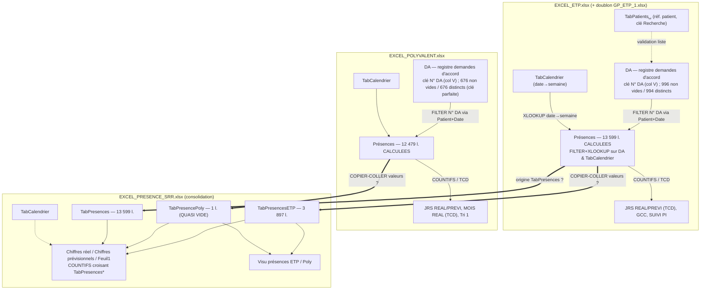

# 02 — Flux de données et diagnostic d'intégrité référentielle (SSR Polynésie, facturation CPS)

**Objet.** Reconstituer comment les données circulent aujourd'hui entre les 4 classeurs Excel (`fichiers_source/`, lecture seule), par quelles clés et quelles étapes manuelles, puis **localiser et chiffrer les ruptures d'intégrité référentielle** — les endroits où une présence ne se rattache pas à une demande d'accord (DA), où un comptage est faux, ou où une erreur reste silencieuse. Ce document n'est **pas** une conception cible : il décrit l'existant et son diagnostic. Socle : `build/01_analyse.md`. Toute hypothèse non prouvée est marquée `[à confirmer]`.

**Méthode de vérification.** openpyxl (`read_only=True` ; `data_only=True` pour les valeurs en cache, `data_only=False` pour les formules), complété par lecture du XML brut des feuilles (`xl/worksheets/sheetN.xml`) pour les `#REF!` que la lecture read_only ne restitue pas. Clés patient normalisées par `Trim + réduction des espaces internes + casse` (`UPPER(re.sub(r"\s+"," ",strip(x)))`). Tous les chiffres ci-dessous proviennent de l'exécution de ces vérifications sur les fichiers réels.

---

## 1. Schéma des flux

Le système est organisé en deux **chaînes métier amont** (ETP, Polyvalent), chacune partant d'un registre de demandes d'accord `DA`, et un **classeur de consolidation aval** `EXCEL_PRESENCE_SRR` qui agrège les présences pour produire les synthèses chiffrées (réel / prévisionnel) servant au pilotage et, in fine, à la facturation CPS.

**Légende des étapes — robustesse :**
- Flèche simple `-->` : **lien par formule Excel** (recalculé automatiquement, traçable).
- Flèche double `==>` : **transfert MANUEL entre classeurs `[à confirmer]`**. Aucun lien externe (`[fichier.xlsx]Feuille!`) n'a été détecté ; les tables `TabPresences*` de SRR ne contiennent **aucune formule** (0 formule sur 13 599 lignes — cf. 01 §1). Elles sont donc le résultat d'un **collage de valeurs** des feuilles `Présences` des classeurs amont, **à confirmer** quant au geste exact (copier/coller-valeurs, ou export). C'est une rupture de chaîne : à chaque mise à jour amont, il faut **recalculer (F9 / Actualiser les TCD) puis recopier** — sinon SRR fige un état périmé silencieusement.
- Les feuilles `Présences` amont sont **dérivées** (FILTER/XLOOKUP/COUNTIFS) ; leurs valeurs en cache ne se matérialisent que si Excel a recalculé avant sauvegarde (d'où des colonnes calculées `N° DA`/`Cotation`/`Groupe` vides en cache — cf. 01 §2/§4).

---

## 2. Inventaire des jointures réelles

| # | Source → Cible | Clé de jointure | Fonction Excel | Robustesse |
|---|---|---|---|---|
| J1 | `Présences.Patient + Date` → `DA.N° DA` | Patient **et** Date ∈ [`Date début accordé` ; `Date fin accordé`] | `FILTER(DA[N°DA] ; (DA[Patient]=Patient)*(début<=Date)*(fin>=Date))` | 🟠 dépend d'un **match exact du nom patient** et d'un intervalle de dates cohérent ; aucune tolérance espaces/casse |
| J2 | `Présences.N° DA` → `DA` (Cotation, Régime, Dates Accord, Nb Je, Groupe) | `N° DA` | `XLOOKUP($E2 ; DA[N°DA] ; DA[...])` | 🟠 **prend la 1re occurrence** en cas de doublon de `N° DA` |
| J3 | `Présences.Date` → `TabCalendrier` (semaine, n° semaine) | `Date` | `XLOOKUP(Date ; TabCalendrier[Date] ; ...)` | 🟢 référentiel calendrier complet (2 193 dates) |
| J4 | `DA.N° DA` → `Présences` (`Nb Je présence`, comptage) | `N° DA` | `COUNTIFS(Présences[Programmation]="Présent" ; Présences[N°DA]=DA[V])` | 🟢 robuste tant que `N° DA` propre |
| J5 | `DA.Patient` (validation saisie) → `TabPatients[Recherche]` | `Recherche` (Nom+date naiss.) | liste déroulante `INDIRECT("TabPatients[Recherche]")` | 🟠 ETP : réf. 2 157 clés ; **Poly : `TabPatients` quasi vide (3 l.)** → la validation ne protège rien côté Poly |
| J6 | `TabPresences*` (SRR) → `Chiffres réel/prév.` | `N° DA` + `semaine`/`Mois` + `REGIMES` | `COUNTIFS` multi-tables | 🔴 dépend du **collage manuel** préalable des tables ; casse silencieusement si non rafraîchi |

> Clé pivot du système : **`N° DA`** (col V des registres `DA`, format `AA/NNNNNN` ex. `22/004641`). Le `Patient` n'est une clé fiable que dans les classeurs amont ; dans `TabPresences` (SRR) la colonne Patient est renseignée sur **5 lignes / 13 599** — l'identification y repose entièrement sur `N° DA + Date`.

---

## 3. Diagnostic des ruptures d'intégrité référentielle

### R1 — `TabPresencePoly` quasi vide : tout le volet Polyvalent est perdu dans la consolidation 🔴
- **Localisation** : `EXCEL_PRESENCE_SRR!TabPresencePoly` (table `Table_1` déclarée A1:O10510) ; consommée par `Chiffres réel`/`Chiffres prévisionnels` (COUNTIFS `TabPresencePoly!...`).
- **Mesure** : la table contient **1 ligne de donnée réellement non vide** sur 10 508 lignes de structure. Or côté source `EXCEL_POLYVALENT!Présences`, la colonne `Programmation` compte **10 216 lignes « Présent »** (sur 12 479). Le total Polyvalent *devrait* donc peser ~10 216 présences `[à confirmer sur le périmètre exact régime/date]`, contre ~0 effectivement consolidé.
- **Mécanisme** : le collage manuel des présences Polyvalent vers `TabPresencePoly` n'a pas été fait (ou écrasé). Les `COUNTIFS` qui pointent `TabPresencePoly` retournent donc ~0.
- **Conséquence métier** : **toute l'activité Polyvalent est absente des `Chiffres réel`** — sous-comptage massif et silencieux du réalisé. Aucune erreur visible : les formules renvoient 0 sans alerte.

### R2 — Étape de transfert amont→SRR non automatisée (tables sans formule) 🔴
- **Localisation** : `EXCEL_PRESENCE_SRR!TabPresences`, `TabPresencesETP`, `TabPresencePoly`.
- **Mesure** : **0 formule** sur ces 3 tables (13 599 + 3 897 + 1 lignes) ; **aucun lien externe** vers les classeurs ETP/Poly détecté. Les en-têtes sont **identiques** à `EXCEL_ETP!Présences` (16 colonnes : Patient, Date, Programmation, No Facture, N° DA, PEC, Cotation, REGIMES, Dates Accord, Nb Je accordés, semaine, Nb actes, Mois, Parcours, Groupe, Colonne1) — ce qui confirme un **copier-coller de valeurs** depuis les feuilles `Présences` amont `[à confirmer sur le geste exact]`.
- **Mécanisme** : à chaque évolution d'un `DA` ou d'une présence amont, il faut recalculer (F9) la feuille `Présences` calculée, **puis recopier manuellement** dans SRR. Rien ne force ni ne trace ce rafraîchissement.
- **Conséquence métier** : risque permanent de **consolidation périmée** ; c'est le mécanisme qui rend R1 possible. Cause racine structurelle (cf. §5).

### R3 — Double source ETP : `EXCEL_ETP` vs `GP_ETP_1` — quel registre fait foi ? 🟠
- **Localisation** : registres `DA` des deux classeurs (sheet11.xml dans les deux).
- **Mesure** : les ensembles de `N° DA` sont **strictement identiques** — 994 distincts de part et d'autre, **0 N° DA présent dans l'un et absent de l'autre**. Les **formules sont identiques**. Les divergences sont uniquement des **états de cache** (cf. 01 §3 : `GCC` 77 l. vs 7 l. ; `DA.Patient` cache 3 vs 22 ; `Détails JRS` ~6 738 valeurs différentes). Métadonnées : `GP_ETP_1` porte l'origine (`creator=Marion UNG`, 2023-12-12) ; `EXCEL_ETP` réécrit par openpyxl `[à confirmer]`.
- **Mécanisme** : deux copies du même classeur coexistent ; elles ne diffèrent que par le dernier recalcul enregistré, pas par les données.
- **Conséquence métier** : **ambiguïté de la source de vérité** (risque d'éditer/consolider la mauvaise copie). Faible risque de divergence de données aujourd'hui, mais aucune règle ne désigne le maître.

### R4 — `#REF!` masqué dans `DA.Age fixe séjour` 🟠
- **Localisation** : `EXCEL_ETP!DA` et `GP_ETP_1!DA` colonne `Age fixe séjour` (col Y) ; idem `EXCEL_POLYVALENT!DA`.
- **Mesure** (XML brut, car non restitué par openpyxl read_only) : **2 012 occurrences `#REF!`** sur la feuille DA d'ETP et de GP (= ~1 006 lignes × 2 : formule + cache), **1 366** sur la feuille DA de Poly (= ~683 lignes × 2). Formule type : `=IFERROR(DATEDIF(XLOOKUP(DA!$B4,#REF!,#REF!,"inconnu"),DA!$AN4,"y"),"")`.
- **Mécanisme** : la plage source du `XLOOKUP` de calcul d'âge a été supprimée → `#REF!`, neutralisé par `IFERROR` qui renvoie `""`.
- **Conséquence métier** : la colonne **`Age fixe séjour` est cassée sur la quasi-totalité des lignes** (toujours vide). Si l'âge entre dans un critère de cotation/contrôle CPS, le contrôle est inopérant — silencieux (masqué par IFERROR).

### R5 — `#VALUE!` littéraux dans `SUIVI PI` 🟡
- **Localisation** : `EXCEL_ETP!SUIVI PI` et `GP_ETP_1!SUIVI PI` (lignes ~6760 et 6763, col A — cf. 01 §2).
- **Mesure** : **2 cellules `#VALUE!`** matérialisées en cache, dans chacun des deux classeurs.
- **Mécanisme** : erreur de type propagée dans une formule de suivi non protégée.
- **Conséquence métier** : 2 lignes de suivi PI faussées ; impact local, repérable.

### R6 — Doublons de `N° DA` dans `DA` → XLOOKUP prend la 1re occurrence 🟠
- **Localisation** : `EXCEL_ETP!DA` / `GP_ETP_1!DA` col V (`N° DA`).
- **Mesure** : **2 N° DA en double** côté ETP/GP (`23/016447`, `24/057259`) ; **0 doublon** côté Polyvalent (676/676, clé parfaite).
- **Mécanisme** : `XLOOKUP` (J2) résout sur la **1re ligne trouvée** ; les attributs (Cotation, Régime, dates, Groupe) de la 2nde demande portant le même N° DA sont ignorés.
- **Conséquence métier** : pour ces 2 demandes, les présences sont rattachées aux **mauvais attributs d'accord** → cotation/régime potentiellement erronés sur la facture.

### R7 — Patients : clés instables (espaces multiples / casse) 🟠
- **Localisation** : colonne `Patient` de `EXCEL_PRESENCE_SRR!TabPresencesETP` (et des feuilles `Présences` amont).
- **Mesure** : sur 3 841 lignes de présence ETP renseignées en patient, **1 229 valeurs portent des espaces parasites** (multiples internes ou de bord). Effet de la normalisation sur le matching au référentiel patient ETP (`TabPatients␣`, 2 157 clés) : **3 809 lignes matchent en clé brute → 3 830 après normalisation**, soit **21 lignes « réparées »** par Trim+espaces+casse. Côté Polyvalent : `Présences.Patient` 1 123 valeurs à espaces multiples, `DA.Patient` 66 (cf. 01 §4).
- **Mécanisme** : la jointure J1 (`FILTER` sur `DA[Patient]=Patient`) exige une **égalité stricte de chaîne** ; un espace double rompt le match. Le référentiel lui-même étant globalement propre (0 collision casse/espace sur les 2 157 clés), l'écart se joue côté saisie des présences.
- **Conséquence métier** : pour les lignes non réparées, **le `N° DA` ne se résout pas** → la présence ne mène à aucune facture. La normalisation est indispensable mais absente du dispositif actuel.

### R8 — Lignes de présence sans `N° DA` résolu (non facturables) 🟠
- **Localisation** : `EXCEL_PRESENCE_SRR!TabPresences` col E (`N° DA`).
- **Mesure** : **493 lignes sur 13 599 sans `N° DA`** (3,6 %). Idem 493/494 sans Cotation/Groupe (cf. 01 §1).
- **Mécanisme** : la jointure J1 (Patient+Date → N° DA) a échoué en amont (patient absent/mal écrit, ou date hors intervalle d'accord), laissant la cellule vide ; la valeur vide est ensuite figée dans SRR.
- **Conséquence métier** : ces **493 présences ne se rattachent à aucune DA → aucune facture CPS possible** ; perte de recette silencieuse.

### R9 — N° DA « orphelins » et DA jamais consommés 🟡
- **Localisation** : `TabPresences`/`TabPresencesETP` (SRR) vs union des registres `DA` (ETP∪POLY = 1 670 N° DA distincts).
- **Mesure** :
  - **N° DA orphelins** (présents en présence, absents de tout registre DA) : **1 clé distincte** (`"23"`, manifestement tronquée), soit **2 lignes** dans `TabPresences` + **1 ligne** dans `TabPresencesETP`. Donc l'intégrité « présence→DA » est **quasi parfaite** sur les lignes effectivement renseignées (le vrai problème est l'absence de N° DA, cf. R8, pas l'invalidité).
  - **DA jamais consommés** (présents au registre, jamais dans une table de présence SRR) : **143** côté ETP et **675** côté Polyvalent (ce dernier chiffre = conséquence directe de R1, `TabPresencePoly` vide).
- **Mécanisme** : la valeur `"23"` est une clé tronquée/mal saisie ; les 143 DA ETP non consommés sont des demandes sans présence consolidée ; les 675 Poly reflètent R1.
- **Conséquence métier** : 1 clé invalide isolée (impact négligeable) ; mais **675 demandes Polyvalent accordées sans aucune présence consolidée** confirment l'ampleur de R1.

### R10 — Doublons (N° DA + Date) dans les présences 🟡
- **Localisation** : `TabPresences` / `TabPresencesETP` (SRR), clé réelle `N° DA + Date`.
- **Mesure** (en se limitant aux lignes où `N° DA` est renseigné — la colonne Patient étant quasi vide, le comptage « Patient+Date » initial de ~801/96-vide est un artefact de la clé vide) : `TabPresences` = **25 couples en doublon (50 lignes)** ; `TabPresencesETP` = **10 couples (20 lignes)**.
- **Mécanisme** : même demande + même date présente deux fois (collage répété, ou double saisie de présence).
- **Conséquence métier** : **risque de double comptage** de la présence dans les `COUNTIFS` → sur-comptage / double facturation potentielle sur ces lignes.

---

## 4. Synthèse — ruptures classées par gravité

| Gravité | Rupture | Localisation | Mesure chiffrée | Conséquence |
|---|---|---|---|---|
| 🔴 | R1 Volet Poly perdu | `SRR!TabPresencePoly` | 1 ligne vs ~10 216 « Présent » attendues | Activité Polyvalent ≈ absente du réalisé |
| 🔴 | R2 Transfert manuel | `SRR!TabPresences*` | 0 formule / 17 497 lignes, 0 lien externe | Consolidation périmée silencieuse |
| 🟠 | R3 Double source ETP | `EXCEL_ETP` vs `GP_ETP_1` | 994=994 N° DA, 0 écart données, caches divergents | Source de vérité ambiguë |
| 🟠 | R4 `#REF!` Age | `DA!Age fixe séjour` (Y) | 2 012 (ETP/GP) + 1 366 (Poly) occ. XML | Calcul d'âge cassé, masqué |
| 🟠 | R6 Doublons N° DA | `ETP/GP!DA` col V | 2 doublons (Poly : 0) | Attributs d'accord erronés |
| 🟠 | R7 Patients instables | `SRR!TabPresencesETP.Patient` | 1 229 à espaces ; 21 lignes réparées par normalisation | Présences non rattachées |
| 🟠 | R8 Présences sans N° DA | `SRR!TabPresences.N° DA` | 493 / 13 599 (3,6 %) | 493 présences non facturables |
| 🟡 | R5 `#VALUE!` SUIVI PI | `ETP/GP!SUIVI PI` | 2 cellules | 2 lignes de suivi faussées |
| 🟡 | R9 Orphelins / DA non consommés | présences vs `DA` | 1 N° DA orphelin (3 l.) ; 143 ETP + 675 Poly DA non consommés | Surtout révélateur de R1 |
| 🟡 | R10 Doublons N° DA+Date | `SRR!TabPresences*` | 25 (+10) couples / 50 (+20) lignes | Double comptage possible |

### Cause racine commune

**Il n'existe pas de chaîne de données intégrée et automatique : la consolidation `EXCEL_PRESENCE_SRR` repose sur un recopier-coller manuel des présences calculées en amont (R2), sans lien, sans contrôle de complétude ni de fraîcheur.** Toutes les ruptures les plus graves en découlent : le volet Polyvalent qui « disparaît » (R1) parce qu'une copie n'a pas été faite, les doublons de lignes (R10) issus de collages répétés, et l'impossibilité de détecter les présences non rattachées (R8) ou périmées. À cela s'ajoute une **fragilité des clés de jointure** : `N° DA` est la bonne clé pivot mais elle dépend, en amont, d'un **match exact du nom patient** (J1) qu'aucune normalisation ne sécurise (R7), et de l'unicité de `N° DA` qu'aucune contrainte ne garantit (R6). Le tout est aggravé par l'**usage systématique d'`IFERROR`** qui transforme les erreurs structurelles (R4) en cellules vides — masquant le problème au lieu de l'exposer.
